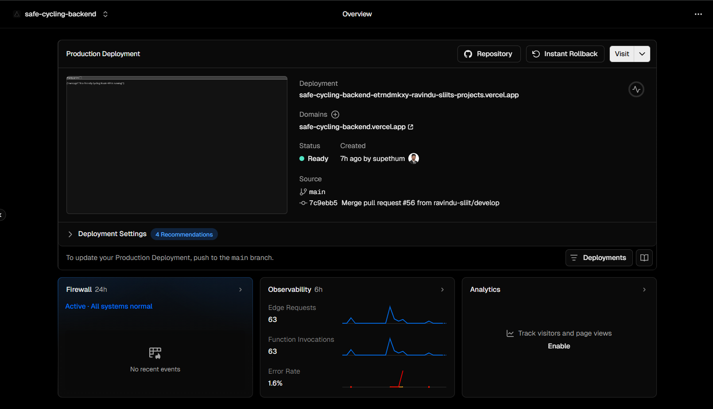
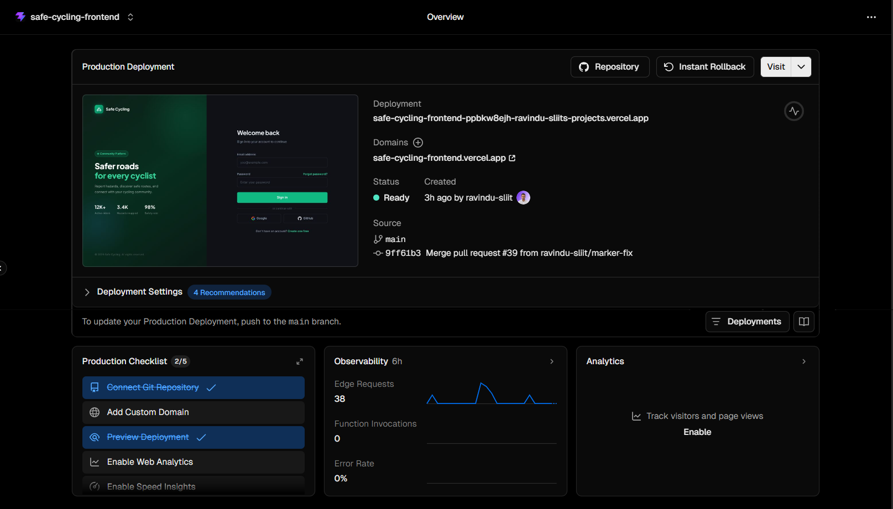
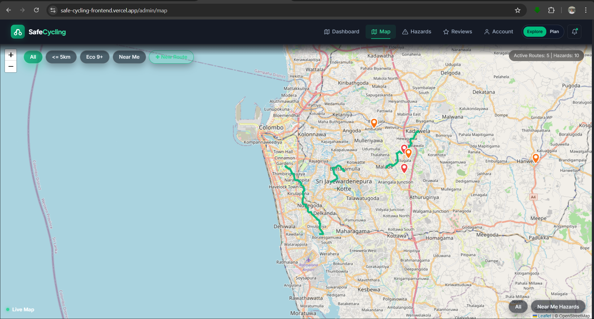
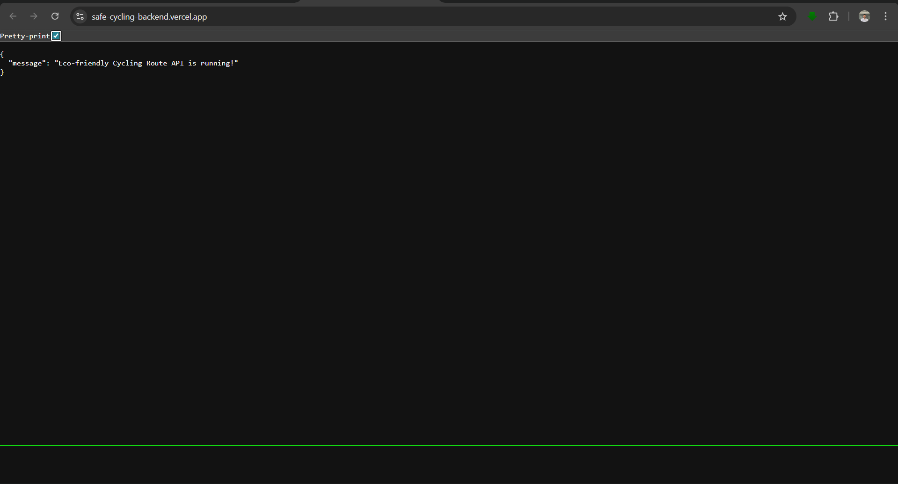

# safe-cycling-backend

Backend API for Safe Cycling. This service provides route management, hazard reporting, review workflows, and user/authentication features for the Safe Cycling platform.

## 1. Local Setup Guide (Step by Step)

### 1.1 Prerequisites

- Node.js 18+ (recommended LTS)
- npm 9+
- MongoDB Atlas connection string (or local MongoDB URI)

### 1.2 Clone and Install

1. Open a terminal in your working folder.
2. Clone and enter the backend project:

```bash
git clone https://github.com/ravindu-sliit/safe-cycling-backend.git
cd safe-cycling-backend
```

3. Install dependencies:

```bash
npm install
```

### 1.3 Configure Environment Variables

1. Create a `.env` file in the project root.
2. Copy the keys from the next section exactly as written (without values).
3. Fill in values for your local/dev environment.

### 1.4 Run the API Locally

Use development mode:

```bash
npm run dev
```

Or production mode locally:

```bash
npm start
```

### 1.5 Verify Startup

- API health check: `GET http://localhost:5000/`
- Swagger UI: `http://localhost:5000/api-docs`

## 2. Environment Variables

The following keys define backend, authentication, email, and deployment behavior.

### 2.1 Backend `.env` keys

```env
PORT=
NODE_ENV=
MONGODB_URI=
JWT_SECRET=
ORS_API_KEY=
IMAGEKIT_PRIVATE_KEY=
IMAGEKIT_UPLOAD_FOLDER=
SMTP_USER=
SMTP_APP_PASSWORD=
SMTP_FROM_EMAIL=
FRONTEND_URL=
PUBLIC_API_URL=
BACKEND_PUBLIC_URL=
EMAIL_VERIFICATION_REDIRECT_PATH=
```

### 2.2 Frontend/Deployment key used with this backend

```env
VITE_API_BASE_URL=
```

## 3. API Documentation (Swagger)

This project uses Swagger as the source of truth for API documentation.

- Local docs: `http://localhost:5000/api-docs`
- Production docs: `https://safe-cycling-backend.vercel.app/api-docs`
- Swagger definition file: `src/swagger.json`

### 3.1 Endpoint Catalog

All endpoints below are documented in Swagger with request/response schemas and examples.

| Method | Endpoint | Auth | Request Body | Success Response |
| --- | --- | --- | --- | --- |
| GET | `/` | Public | None | `{ message }` |
| POST | `/api/auth/login` | Public | `{ email, password }` | `{ success, token }` or `{ requiresTwoFactor, twoFactorToken }` |
| POST | `/api/auth/verify-2fa` | Public | `{ twoFactorToken, code }` | `{ success, token, user }` |
| POST | `/api/auth/resend-2fa` | Public | `{ twoFactorToken }` | `{ success, twoFactorToken, twoFactorCodeExpiresAt }` |
| GET | `/api/auth/verify/:token` | Public | None | HTML redirect/page or JSON success |
| POST | `/api/auth/forgotpassword` | Public | `{ email }` | `{ success, message }` |
| POST | `/api/auth/resend-verification` | Public | `{ email }` | `{ success, message }` |
| GET | `/api/auth/resetpassword/:token` | Public | None | Redirect to frontend reset page |
| PUT | `/api/auth/resetpassword/:token` | Public | `{ password }` | `{ success, message }` |
| PATCH | `/api/auth/change-password` | Bearer | `{ currentPassword, newPassword }` | `{ success, message }` |
| GET | `/api/routes` | Public | None | `{ success, count, data: Route[] }` |
| POST | `/api/routes` | Bearer (admin, organization) | Route payload | `{ success, data: Route }` |
| PUT | `/api/routes/:id` | Bearer (admin, organization) | Partial route payload | `{ success, data: Route }` |
| DELETE | `/api/routes/:id` | Bearer (admin) | None | `{ success, message }` |
| GET | `/api/hazards` | Public | None | `HazardReport[]` |
| GET | `/api/hazards/:id` | Public | None | `HazardReport` |
| POST | `/api/hazards/upload-image` | Bearer | multipart image | `{ success, url, fileId }` |
| POST | `/api/hazards` | Bearer | Hazard payload | `HazardReport` |
| PUT | `/api/hazards/:id/like` | Bearer | None | `HazardReport` |
| PUT | `/api/hazards/:id` | Bearer | Hazard update/community update payload | `HazardReport` |
| PUT | `/api/hazards/:id/updates/:updateId` | Bearer | `{ comment, status, imageUrl }` | `HazardReport` |
| DELETE | `/api/hazards/:id/updates/:updateId` | Bearer | None | `HazardReport` |
| DELETE | `/api/hazards/:id` | Bearer | None | `204 No Content` |
| POST | `/api/users` | Public (or admin bearer for privileged role creation) | User registration payload | `{ success, message, data }` |
| GET | `/api/users` | Bearer (admin) | None | `{ success, count, data: User[] }` |
| GET | `/api/users/me` | Bearer | None | `{ success, data: User }` |
| PATCH | `/api/users/me` | Bearer | user profile fields | `{ success, data: User }` |
| PATCH | `/api/users/me/two-factor` | Bearer | `{ enabled, currentPassword }` | `{ success, message, data }` |
| PATCH | `/api/users/me/email` | Bearer | `{ email, currentPassword }` | `{ success, message, data }` |
| GET | `/api/users/:id` | Bearer (self/admin) | None | `{ success, data: User }` |
| PUT | `/api/users/:id` | Bearer (self/admin) | user profile fields | `{ success, data: User }` |
| POST | `/api/users/:id/profile-image` | Bearer (self/admin) | multipart image | `{ success, message, data }` |
| DELETE | `/api/users/:id/profile-image` | Bearer (self/admin) | None | `{ success, message, data }` |
| DELETE | `/api/users/:id` | Bearer (self/admin) | None | `{ success, message }` |
| GET | `/api/reviews` | Bearer (admin) | None | `{ success, reviews, count, averages }` |
| GET | `/api/reviews/route/:routeId` | Public | None | `{ success, reviews, count, averages }` |
| POST | `/api/reviews` | Bearer (user) | `{ route, rating, difficulty, distance, comment, pitStops }` | `{ success, data }` |
| PUT | `/api/reviews/:id` | Bearer (user/admin) | review update fields | `{ success, data }` |
| POST | `/api/reviews/:id/vote` | Bearer | `{ type: "up"|"down" }` | `{ success, data }` |
| DELETE | `/api/reviews/:id` | Bearer (admin) | None | `{ success, message }` |

### 3.2 Request/Response Examples

Use Swagger UI for complete examples per endpoint. Sample requests:

```bash
curl -X POST http://localhost:5000/api/auth/login \
  -H "Content-Type: application/json" \
  -d '{"email":"user@example.com","password":"StrongPassword123"}'
```

```bash
curl -X GET http://localhost:5000/api/routes
```

```bash
curl -X POST http://localhost:5000/api/reviews \
  -H "Authorization: Bearer <JWT_TOKEN>" \
  -H "Content-Type: application/json" \
  -d '{"route":"<ROUTE_ID>","rating":5,"difficulty":"Easy","distance":5.2,"comment":"Great ride"}'
```

## 4. Functional Components and Requirements

At least four core business components implemented in this backend:

1. Authentication and Account Security
	- Login with JWT token issuance.
	- Optional 2-step verification (email OTP) support.
	- Email verification, password reset, and authenticated password change.

2. Route Management and Eco Routing
	- Create/update routes with route geometry and distance calculated from OpenRouteService.
	- Public route retrieval and role-protected route administration.
	- Route metadata includes eco score and path coordinates.

3. Hazard Reporting and Community Updates
	- Hazard creation with geolocation and severity/state tracking.
	- Image upload support for hazards.
	- Community update workflow with status history and ownership checks.

4. Reviews and Feedback Intelligence
	- One review per user per route enforcement.
	- Rating, difficulty, distance, and comment moderation.
	- Upvote/downvote interaction and route-level rating aggregates.

5. User Profile and Preferences
	- Self-service profile updates and admin controls.
	- Profile image upload/remove APIs.
	- Email update flow with re-verification and two-factor settings.

## 5. Third-Party API Integration

### OpenRouteService

OpenRouteService is integrated in route creation/update logic to:

- calculate cycling route distance from start/end coordinates,
- generate path coordinates used by clients for map rendering,
- avoid manual route geometry input and keep route calculation deterministic.

Why it is integrated:

- Provides accurate route planning for bike travel mode.
- Supports consistent backend-generated route metrics.
- Reduces risk of client-side manipulation of route distance/path.

Additional third-party services in use:

- ImageKit: hazard image upload and hosted media URLs.
- Nodemailer (Gmail SMTP): verification, password reset, and 2FA emails.

## 6. Testing Instruction Report

### 6.1 Environment Configuration for Tests

- In-memory database: `mongodb-memory-server` for isolated runs.
- API mocking: external OpenRouteService requests mocked with `jest.mock('axios')`.
- Test mode: `NODE_ENV=test` prevents production DB connect/listen side effects.
- Stability flags: Jest uses `--runInBand --testTimeout=60000 --detectOpenHandles`.

### 6.2 How to Run Unit Tests

Jest is the test runner. If unit tests are organized under a unit path, run:

```bash
npm test -- --testPathPatterns=unit
```

Current project tests are API-focused suites under `tests/` and run with the main command below.

### 6.3 How to Run Integration Tests

```bash
npm test
```

Optional watch mode:

```bash
npm run test:watch
```

Implemented suites:

- `tests/routes.test.js`
- `tests/hazardRoutes.test.js`
- `tests/reviewRoutes.test.js`
- `tests/userRoutes.test.js`

### 6.4 Performance Testing (Artillery)

Load profile: `load-test.yml`

Run performance test:

1. Start API:

```bash
npm start
```

2. In another terminal:

```bash
npm run load:test
```

Latest executed mixed-load run summary:

- Total requests: 1126
- HTTP 200 responses: 847
- Timeout errors (`ETIMEDOUT`): 279
- Mean response time: 2634.6 ms
- p95 response time: 9230.4 ms
- p99 response time: 9801.2 ms

## 7. Deployment Section (Evidence)

### 7.1 Architecture Overview

- Frontend: React (Vite) on Vercel static hosting
- Backend: Node.js/Express on Vercel serverless runtime
- Database: MongoDB Atlas
- Media storage: ImageKit

### 7.2 Deployment Configuration Evidence

- Serverless routing config: `vercel.json`
- Express entrypoint for deployment: `src/server.js`

### 7.3 Successful Deployment Evidence (Links)

- Frontend live URL: https://safe-cycling-frontend.vercel.app
- Backend live URL: https://safe-cycling-backend.vercel.app
- Backend API docs (live Swagger): https://safe-cycling-backend.vercel.app/api-docs
- Vercel dashboard (build/deployment logs): https://vercel.com/dashboard

### 7.4 Successful Deployment Evidence (Screenshots)

The following screenshots should be placed in `docs/screenshots/`.

#### Backend Vercel Production Deployment



#### Frontend Vercel Production Deployment



#### Frontend Live Application (Map View)



#### Backend Live Runtime Check



### 7.5 Quick Runtime Verification (Cloud)

- Health endpoint: https://safe-cycling-backend.vercel.app/
- Routes endpoint: https://safe-cycling-backend.vercel.app/api/routes

These public endpoints provide direct evidence that the deployed backend is reachable and serving API traffic in cloud production.